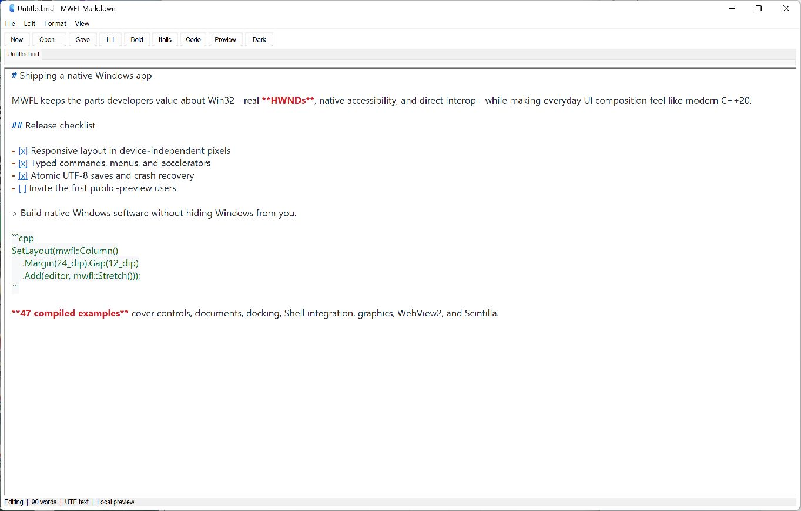

# MWFL Markdown

[](https://github.com/mwfl/markdown-editor/actions/workflows/ci.yml)

MWFL Markdown is a native, local-first Markdown editor for Windows. It combines a Scintilla/Lexilla editing surface with a safe GitHub-flavored Markdown preview hosted by WebView2.



## Features

- Native tabbed documents with dirty-state tracking.
- Markdown syntax highlighting powered by Lexilla.
- Edit and preview modes with light and dark themes.
- GFM rendering through md4c with raw HTML disabled.
- Unicode open/save with atomic replacement and external-change detection.
- Find/replace, common formatting commands, menus, and keyboard shortcuts.
- Crash-recovery snapshots and session restoration.
- Editing and saving remain available if WebView2 Runtime is unavailable.

Files remain local. Preview rendering happens inside the application and no document content is transmitted to a service.

## Download

Download the versioned `windows-x64-portable.zip` from [GitHub Releases](https://github.com/mwfl/markdown-editor/releases), verify it with the accompanying SHA-256 file, and extract it anywhere. The WebView2 Runtime is required for preview; editing and saving continue to work without it.

## Build

Visual Studio 2026 is recommended for local development next to an `mwfl` checkout:

```powershell
cmake --preset vs2026-x64
cmake --build --preset vs2026-x64-release
ctest --preset vs2026-x64-release
```

For a standalone clone, use the `vs2022-x64` preset. It fetches the pinned MWFL Foundation baseline plus Scintilla/Lexilla, WebView2 SDK, and md4c sources. The WebView2 Runtime must be installed on the machine for preview; Windows 11 normally includes it.

## Dependencies and licenses

The application is MIT licensed. Portable packages include license notices for Scintilla/Lexilla and md4c. WebView2 is linked using Microsoft's static loader; the runtime is supplied separately by Microsoft.
